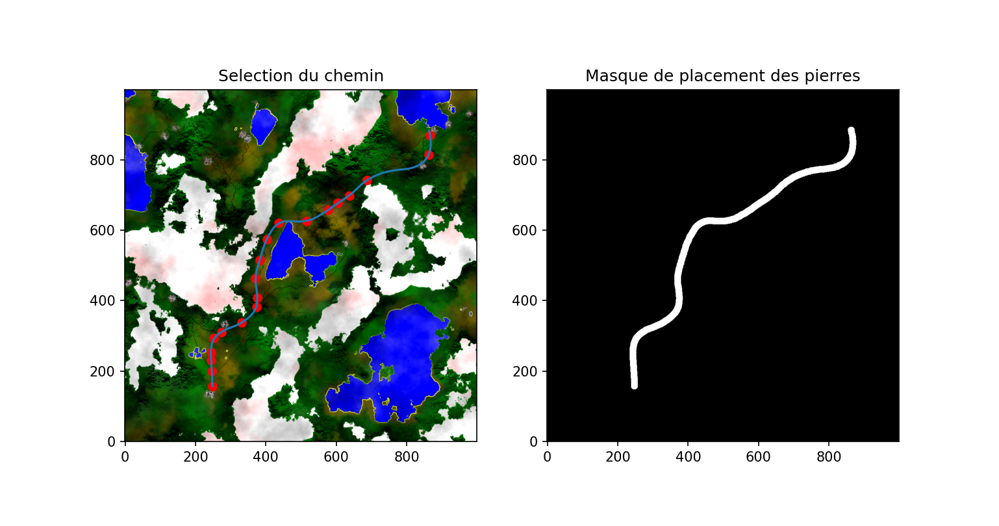

# Plaquage De Texture
Dans ce projet realiser à l'enseeiht,il fallais genere des chemin sur des environnement 2D puis 3D.
  
# Comment l'utiliser:  
## 2D  
lancer dans :  
- `2D/bin/Segmentation.py` pour segementer des pierre et obtenir une liste de pierrex.  
- `2D/bin/interpolation.py` pour choisir des points sur une image et tracer un chemin.  
- `2D/bin/placementPierre.py` pour placer des pierres sur le chemin prétracé.  
## 3D  
Pour 
- dans le dossier 3D: `cd ./3D/`
- lancer le script : `3D/HeightMapPerlin_2D.py` pour genere la height map
- lancer le serveur 3D : `python3 -m http.server` 
- allez sur: https://localhost:8000/3D.html
- Pour mettre les profondeur sur la carte lancer dans le terminal (F12 ou Ctrl+maj+K)
- lancer dans la console :`elevation()`

# Resultat  
## 2D
Segmentation:  
 ->
  
Interpolation:  
  
PlacementPierre:  
  

## 3D
Elevation(Perlin):  
 +
 =  

# TUTO PARTIE 2 (episode 1,2,3) : 
https://www.youtube.com/watch?v=cNY2s5Kq9lE&list=PLUWxWDlz8PYLIG5w43tcZdaglQgXAQIPs

Diapo1 : https://docs.google.com/presentation/d/1fKxdaK1dGF2nwMzsvcgNm8bE_h8z6WOxYnt-td3aOTI/edit#slide=id.p  
Diapo2 : https://docs.google.com/presentation/d/1IkIVrF--LcNEU5mPC5R7T3Ra6WYOus6l-YH3rk2IHhc/edit#slide=id.g10bb9196d25_0_0  

PARTIE 1 :

  Rapport 1 (Aller)        : https://www.overleaf.com/project/61ae0c8853335a2cfb8fd00f

  Rapport 2 (Intermediaire): https://www.overleaf.com/project/6194b28ff434d7c8a9f3e38d

  Rapport 3 (Retour)       : https://www.overleaf.com/6519969689wwqktmtwxvyp

Partie 2 : 

  Rapport 1 (Aller)        : https://www.overleaf.com/project/61dc32792770901874bd7e1f
  
  Rapport 2 (Retour)       : https://fr.overleaf.com/project/61f2b7207872595db8aa1b7d
